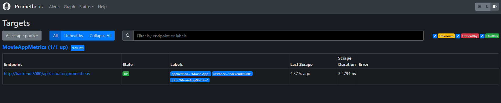
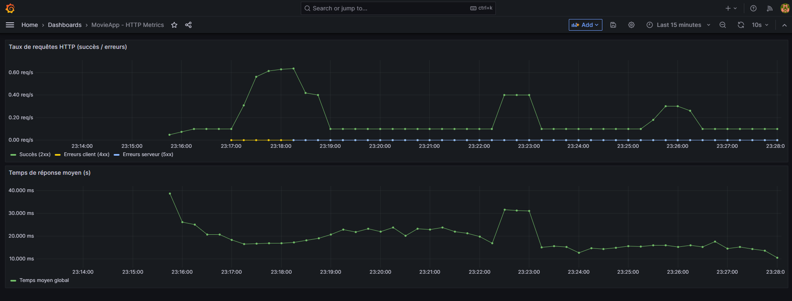
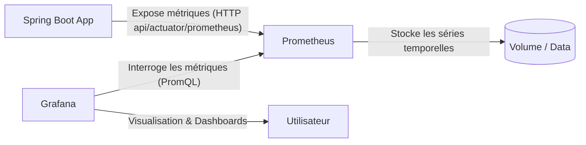

# movieapp-monitoring
Environnement de monitoring containerisée pour MovieApp, basée sur Prometheus et Grafana permettant de collecter, stocker et visualiser en temps réel les métriques.

---

## Accès aux interfaces

### Prometheus

- **URL** : [http://localhost:9090](http://localhost:9090/targets?search=)
- **Container Docker** : `movieapp-prometheus`
- **Port exposé** : `9090`
- **Rôle** : collecte automatiquement les métriques exposées par l’application via l’endpoint  
  [`/api/actuator/prometheus`](http://localhost:8080/api/actuator/prometheus)

---

### Grafana

- **URL** : [http://localhost:3000](http://localhost:3000)
- **Container Docker** : `movieapp-grafana`
- **Port exposé** : `3000`
- **Identifiants par défaut** :

  | Champ | Valeur |
    |--------|--------|
  | Nom d’utilisateur | `admin` |
  | Mot de passe | `admin` |
- **Rôle** : se connecte à Prometheus pour visualiser les métriques via des dashboards (HTTP, JVM, etc.)

---

## Intégration avec Spring Boot

- L’application expose ses métriques sur l’endpoint :
  ```
  /api/actuator/prometheus
  ```
- Ces métriques sont automatiquement **collectées toutes les 10 secondes** par Prometheus (`scrape_interval: 10s`).
- Grafana interroge Prometheus via **PromQL** pour construire les dashbords.

---

## Schéma de fonctionnement



---

## Volumes persistants

| Service | Volume associé | Contenu stocké |
|----------|----------------|----------------|
| Prometheus | `./monitoring/prometheus` | Configuration + données des métriques |
| Grafana | `./monitoring/grafana` | Dashboards + provisioning + état de configuration |

---

## Dashboards inclus

- **HTTP Metrics Dashboard**
    - Taux de requêtes (2xx, 4xx, 5xx)
    - Temps de réponse moyen
    - Taux d’erreurs global (%)

Fichier :
```
monitoring/grafana/provisioning/dashboards/movieapp-http-dashboard.json
```

